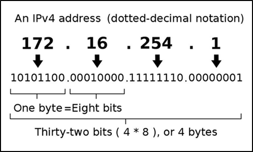
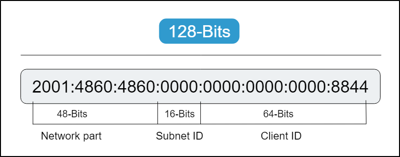

## IP Address
#Networking 
> An IP address is **a unique address that identifies a device on the internet or a local network**. IP stands for "Internet Protocol," which is the set of rules governing the format of data sent via the internet or local network.

As a pentester, you are going to be dealing with IP addresses most of the time. There are 2 types of IP addresses;
1. **IPv4** - Most common type, uses 4 sets of octets (8 bit per set, 32 bits in total) to represent an address.

2. **IPv6** - Introduced to overcome the shortcomings of IPv4. Address is represented in quartets of hex values.

Despite the advanced data representation in **IPv6**, it is not easy to deal with. **IPv4** still remains dominant *(hopefully at the time of you reading this as well)* and its simple representation makes it easy to work with.

These IP addresses fall under 2 more categories;
1. **Public IP address** - Used to identify a machine on the internet. Combined effort of your ISP (Internet Service Provider) and the Local Networking Device is used to assign (lease out) a public IP address to your machine.
2. **Private IP address** - Used to identify machines in a private/enclosed network, away from the public Internet. For an example, a LAN network in a household. Local Networking Device is responsible for assigning private IP addresses.

Sub-divisions of the same IP network can exist which are known as [Subnets](2.%20Subnet), this is usually done to group devices connected to a network for ease of identification.
